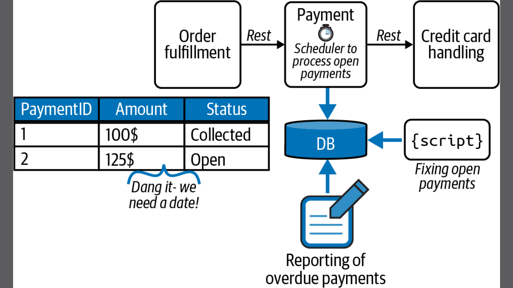

# Wild West Integration

Imagine Ash is a backend developer who gets tasked with building a small backend system for collecting payments via credit card. This doesn’t sound too complex, right? Ash starts right away and designs a beautiful architecture. In conversations with the folks doing order fulfillment, they agree that providing a REST API for the order fulfillment service is the easiest option to move forward. So Ash goes ahead and starts coding it.

Halfway through, a colleague walks in and looks at Ash’s whiteboard, where the beauty of the architecture is captured. The colleague casually says, “Ah, you’re using that external credit card service. I used to work with it, too. We had a lot of issues with leaky connections and outages back then; did that improve?

This question takes Ash by surprise. This expensive SaaS service is flaky? That means Ash’s nice, straightforward code is too naive! But no worries, Ash adds some code to retry the call when the service is not available. After chatting a bit more, the colleague reveals that their service suffered from outages that sometimes lasted hours. Puh—so Ash needs to think of a way of retrying over a longer period of time. But darn it, this involves state handling and using a scheduler! So Ash decides to not tackle this right away but just add an issue to the backlog in the hopes that the order fulfillment team can sort it out. For now, Ash’s code simply throws an exception when the credit card service is unavailable, with fingers crossed that all will work out well.

Two weeks into production, a different colleague from order fulfillment walks over, alongside the CEO. What the heck? It turns out Ash’s system raises a lot of “credit card service unavailable” errors, and the CEO is not happy about the amount of orders not being fulfilled—this issue has resulted in lost revenue. Ash tries to act immediately and asks the order fulfillment team to attempt retrying the payments, but they have to iron out other urgent problems and are reluctant to take over responsibilities that should be handled by Ash’s service.

Ash promises to fix the situation and get something live ASAP. Back at their desk, Ash creates a database table called payment with a column called status. Every payment request gets inserted there, with a status of open. On top of that Ash adds a simple scheduler that checks for open payments every couple of seconds and processes them. Now the service can do stateful retries over longer periods of time. This is great. Ash calls the order fulfillment folks and they discuss the changes needed in the API, as payments are now processed asynchronously. The original REST API will hand back HTTP 202 (Accepted) responses, and Ash’s service can either call back the fulfillment service, send them some message, or let them periodically poll for the payment status. The teams agree on the polling approach as a quick fix, so Ash just needs to provide another REST endpoint to allow querying the payment status.

The change gets rolled out to production and Ash is happy to have dealt with the CEO’s concerns. But unfortunately, the peace doesn’t last too long. A caravan of people arrive in Ash’s office, including the director of operations. They tell Ash that no orders can be shipped because no payments are successfully being taken. What? Ash makes a mental note to add some monitoring to avoid being surprised by these situations in the future, and takes a look at the database. Oh no, there are a huge amount of open payments piling up. Digging a bit into the logs Ash discovers that the scheduler was interrupted by an exceptional case and crashed. Dang it.

Ash puts the one poisoned payment that interrupted the whole process aside, restarts the scheduler, and sees that payments are being processed again. Relieved, Ash vows to keep a closer eye on things and hacks together a small script to periodically look at the table and send an email alert whenever something unusual happens. Ash also decides to add some mitigation strategies for the exceptional case to that script. Great!

After all these stressful weeks, Ash plans to go on vacation. But it turns out that the boss isn’t too happy about Ash leaving because nobody except Ash actually understands the tool stack that they just built. Even worse, the boss instead pulls out a list of additional requirements for the payment service, as some business folks have heard about the flaky credit card service and want more in-depth reports about availability and response times. They also want to know if the agreed-on service level agreement (SLA) is actually being met and want to monitor that in real time. Gosh—now Ash has to add report generation on top of a database that hadn’t seemed necessary in the first place. Figure 1-1 shows the resulting mess in its full beauty.




“Unfortunately, Ash just used a far-too-common approach to automate processes that I call Wild West integration. Ash needed to write a lot of code for features that are built-in capabilities of a workflow engine: keeping the current state, scheduling retries, reporting on the current state, and operating long-running processes. Instead of writing your own code, you should leverage existing tools. There’s really nothing to gain by rolling your own solution. Even if you think that your project doesn’t need the additional complexity of a workflow engine, you should always give it a second thought.

```
Tip:

Coding processes without a workflow engine typically results in complex code; state handling ends up being coded into the components themselves. This makes it harder to understand the business logic and business process implemented in that code.
```

Ash’s story could also easily lead to the development of a homegrown workflow engine. Such company-specific solutions cause a lot of development and maintanence effort and will still lack behind what existing tools can deliver.”

Excerpt From: Bernd Ruecker. “Practical Process Automation”. Apple Books. 