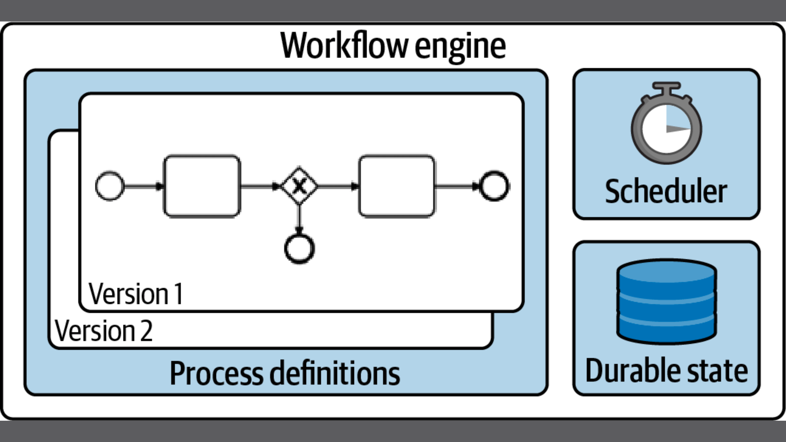

# What is workflow engine?

As you saw in the introduction, a workflow engine is the key component for automating the control flow of a long-running process.

Core Capabilities:

Durable state (persistence)
 - The engine keeps track of all running process instances, including their current state and historical audit data. While this sounds easy, durable state is still a challenge to handle, especially at scale. It also immediately triggers subsequent requirements around understanding the current state, which means you will need operations tooling. A workflow engine ”

Scheduling
- A workflow engine needs to keep track of timing and possibly escalate if a process gets stuck for too long. Therefore, there must be a scheduling mechanism that allows the engine to become active whenever something needs to be done. This also allows tasks to be retried in the event of temporary errors.

Versioning
- Having long-running processes means that there is no point in time when there is no process instance running. Remember that in this context “running” might actually mean waiting. Whenever you want to make a change to a process, such as adding another task, you need to think about all the currently running instances. Most workflow engines support multiple versions of a process definition in parallel. Good tools allow migrating instances to a new version of the process definition, in an automatable and testable manner.

