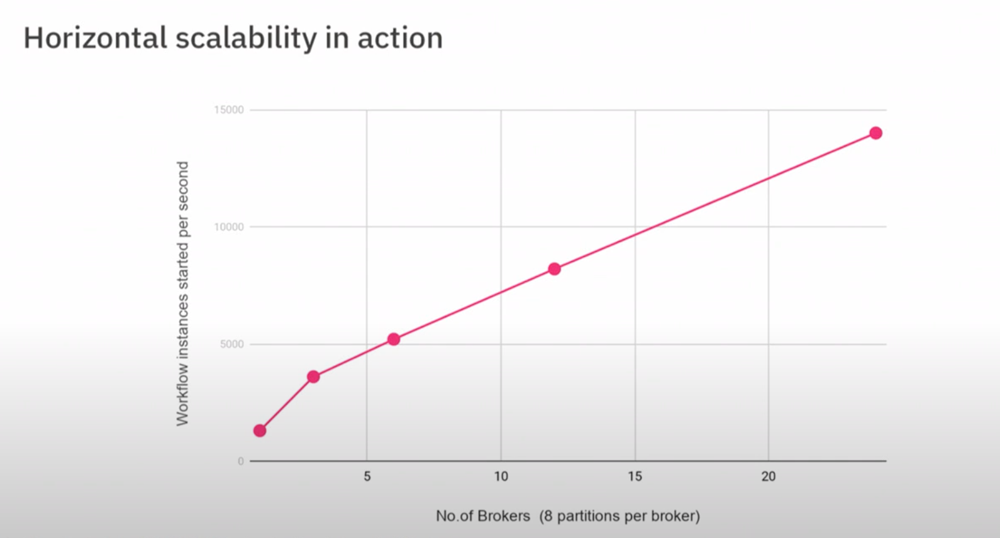

# Scalable workflow engine

So you might have seen a glimpse of Zeebe generally.

&nbsp;&nbsp;&nbsp;&nbsp;&nbsp;


What is Zeebe?

Zeebe is scalable distributed workflow engine and that's what makes it different from others. So why do you need to scale a workflow engine. Right?
So there are many new workflow automation use cases that coming up that needs to process not just hundreds of workflows but hundreds of thousands of workflows per second.
So this opens up a question. Can existing tools really handle load in such a large scale.


## Traditional workflow engines

```
So let's say. This is typical architecture of a traditional workflow engine.  So you have a central database and you have a workflow engine. that store all the state needed to process a workflow. 
```


```
So it stores all the state into the central database and if we need to scale if you want to process more stuff what you do typically is add more of workflow engines there.
```


```
So you can do more or you can process more things in parallel but all of the engines write to same central database. So at some point the central database become a bottleneck and you can not scale anymore.
``` 


And thats why they needed to rethink the entire architecture. 

## Zeebe

So zeebe is as I said so horizontally scalable workflow engine. It is designed from bottom up based on well-known principles from of distributed systems. So it is specifically 
designed to horizontally scalable and fault tolerant and to large workflow automation requirements. 


### Core of Zeebe

Basic Knowledges

https://docs.camunda.io/docs/components/zeebe/technical-concepts/architecture/


Core of Zeebe is Zeebe cluster so it can consist of one or more brokers. So the broker is the one that is actually doing workflow processing. So it can have more than one brokers and there is also this gateway. The cluster can have one or more gateways. The gateway receives requests from clients and then distribute it among the brokers. So i am going to zoom in here.


And discuss these three main concepts:

- Event log
- Partitions
- Replications

That makes Zeebe scalable and fault tolerant

## Event log


So the first of all there is not central database in Zeebe. Instead all the changes to a workflow is written into this event log. So the workflow processors write into event log. So event log is like a sequence of events, the processor reads the event from the log to process it and then appends it back to this event log. 
So for example lets see what happens when a client want to create a workflow instance. So assume it wants to create this very simple workflow. So what client does is it first sends a command like create workflow instance  and that event is first returned to this event log.


And then we have a workflow processor that is reading events from this log. So it first reads that command process it and see all the checks okay can i create workflow instance now?

YES? So it creates it and then it writes and event ok workflow instances created.


And then the processor goes to the next event in same log and then it processes it. Ok so workflow instance is created what is next? So we have to create, we have to start with
the start event because thats the first thing in the workflow.


Ok it is then writing in the event log so start doing this and then it further forces these events and then it reaches the service task and then it is okay now.


Service task is created and then client can so if you are familiar with Camunda thats more like a external task pattern. client can then activate the job. So the client sent another command activates the task.


So that is again return to same event log and the workflow processor and then workflow processor reads the command and then say okay now this all you can activate and then it rises okay task is activated and then it send the response back to the client. 


Like you see here the changes of workflow processing is captured as a series of events. So state changes you can see it from the event. So the events that i showed here are like this abstraction. In Zeebe events are more fine-grained and there are more steps actually happening here. So if you are interested you can go here and to see exactly what happenning inside but you just get the idea this is whats happening. 

So there are several advantages having such an event log so for example, if the system crashes and restart you can just rebuild the state by you know  going through all the events. You dont have to worry about partially written transactions or partial commits or anything.

But what i want to focus here is that because of all the events totally ordered there is a sequental this across processor processing sequentially. You can easily handle concurrent events. 

For example assume that there are two clients trying to activate job at the same time. So this is the command together at the same time. but one of the command is written to the event log first and then second command is written.


So the workflow processor is here now. It first reads the first command and then process it and it say okay there is one job available so you can activate the task.


And then it goes to next command and then it proccess and it sees the task is already activated and then there is no new task. So then you would say okay no task available. please try later.


So it is because all the commands and events are in already totally ordered in the event log so you have like a deterministic order in which these things are processed.
So you dont need to kind of lock the database or using any other synchronization things to handle this concurrent operations.

### Sum up for event logs

So to kind of sum up you have a workflow processor and which is writing events to this event log  and you have like a say there is one processor sequentally processing it.


```
So now what would you do if you want to scale this?
```

## Partitions (Horizontal scaling by partinioning)

If you want scale this of course add more of these things.


So thats what we call partition here. So in Zeebe partition consists of one event log and one processor that is processing the events from that log and you can have more than one partition in a cluster and if you have more than one broker this partitation will be distributed among brokers.

So for example in here if lets you may have two brokers and then two partitions can be in one broker and the another one is in another broker.


Now if assume a client is sending another command to create a workflow, so the gateway when receive command it picks one of the partition and then forward the request to hat partition. So that workflow will be created in that particular partition. and all the state needed to process that workflow will be handled by that partition for the rest of its life.


So main thing is that there is not data shared among partitions. So if you need to process a workflow you dont have to talk to others. So you can just in the progress independently  so that you don't need to communicate with or to be synchronized. So what does give you? If you add more partitions you can do more things parallel and so this what we expect. when we add more partitions you can scale throughput.

And Let's see thats the case. So some evalutions in here so we want to measure the horizontal scalibility of Zeebe.



what is there measure the number of worklow instances created per second so we first started one broker with eight partitions then we added more brokers so and so you can see that so you have 8 brokers and multiple 24 x 8 partitions. So you can see that we kind of almost linearly scale with the number of partitions. So thats what kind of scalibility we expect from zeebe.

So now we talk about event log and the scalibility and next thing when we talked about this scale system especially when we talk about cloud and other staffers like fault tolerance.


Like what we do something fails and it can fail. Right? So there are many cases like hardware can go wrong so we have to take care of these things what should happen when something went wrong and in Zeebe we does that by replicating that partition. SO EACH PARTITION CAN HAVE MORE THAN ONE REPLICA and each replica is managed by different brokers.
So in here RAF algorithm is used. It is algorithm for distrubuted stuff in cloud native env.

So main idea here is you have ONE LEADER which writes events to the log so in our case is also doing workflow processing and you have the followers which
is just replicating events. 

And now lets say leader crashes now leader is doing workflow processing and it suddenly machine crashes for example what will happen?


one the of follower become leader and it continious processing from the point where the leader stop. so we dont have any central component who is the leader and it is RAF protocol and replicas talk to each other it is like democratic election and choose who is leader and it can continue processing.


So now we have learned about what Zeebe cluster consist of if you want to setup Zeebe cluster. you have main three thing think about. 

Three factors:

- One of this cluster size means number of brokers you have in cluster
- Partition count so number of partitions in the cluster. So as i said more number of partitions you can do more thing in paralel so it is better for throughput
- Replication factor says how many replicas you need for each of partition.


 So replication factor effects to fault tollerance and number of partitions effects scalibility


# Links

https://docs.camunda.io/docs/components/zeebe/technical-concepts/index/
