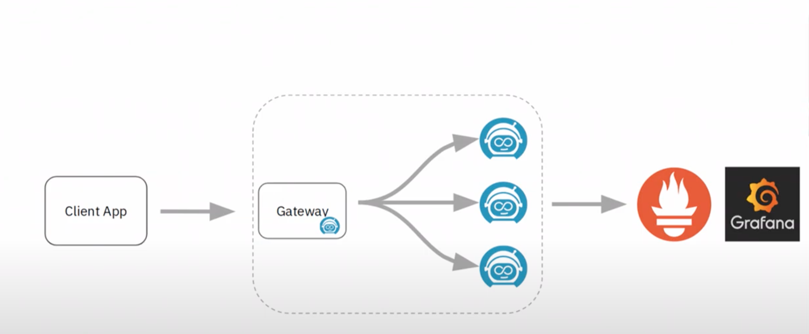
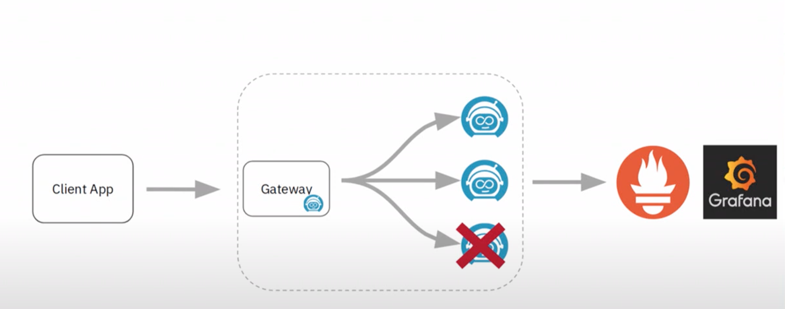

# Advanced Demo for Zeebe

Ok lets see something in action:



I have prometeus and grafana what is happening inside. We have small client app which kind of generate some workload to zeebe. And we are gonna kill one of them to see what happens:

Client apps create workflows in a fixed frequency and there is also job worker that kind of activate the task and complete them. it is jave app communicates with Zeebe



Commands:

```
make zeebe
make grafana
make status
make starter worker  
make status
docker-compose stop zeebe-0
```